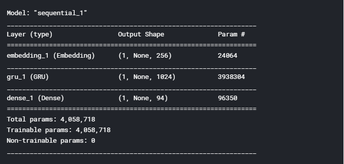
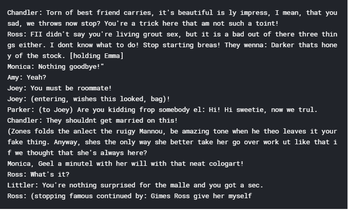

# AI-Friends-Script-Generator
Using Recurrent Neural Network architecture for predicting new script for Famous American Sitcom Friends.

# About the Dataset 

***I have taken dataset from a [GitHub](https://raw.githubusercontent.com/uragirii/Friends-Generator/master/Data/Friends_Transcript.txt) of Uragiri***

**I used popular sitcom Friends Dataset for generating new scripts using RNN architecture**

**Info on Friends sitcom(1994-2004) can be found [here](https://en.wikipedia.org/wiki/Friends)**

# Notebook 

**I have used Kaggle [notebook](https://www.kaggle.com/digvijayyadav/ai-friends-script-generator?scriptVersionId=36381592) for demonstrating this project and due to availinility of GPU/TPU on it. You can also use Colab for this**

**I have taken insights from [tensorflow's original notebook](https://www.tensorflow.org/tutorials/text/text_generation) for understanding and analyzing the script data**

**Easy to understand approach was made and you can see it either here on the repo or in the above mentioned Kaggle Notebook**

# Visualizations

**RNN model architecture used**

**Loss Plot**

**Model layout**

**Predictions**

**Although after 30 iterations still there are some grammatical errors maybe more number of iterations can be considered as an alternative. Hope this helps you out!!**

***Do upvote my notebook on Kaggle and comment if any changes can be made, Happy learning!!***
